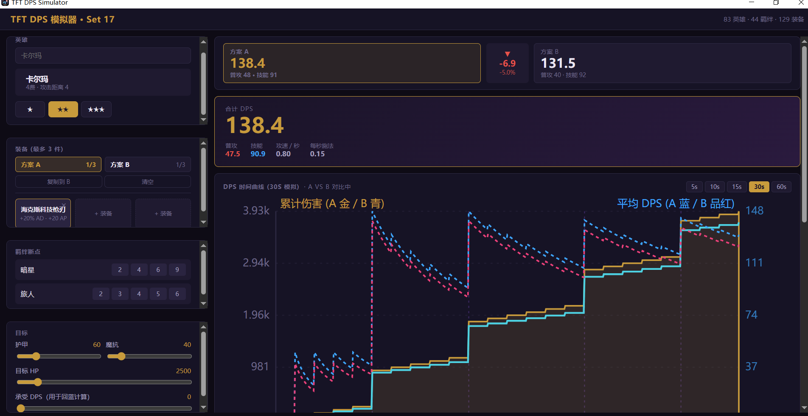

# TFT DPS 模拟器



一个用于《英雄联盟：云顶之弈》（TFT）的单英雄 DPS 模拟器桌面应用。选择英雄、星级、装备方案、羁绊断点与目标假人后，计算有效 DPS，并用时间曲线展示输出节奏。

当前版本聚焦 **Set 17 单英雄打桩模拟**：普攻、on-hit、技能循环、目标护甲/魔抗、起始蓝/回蓝、A/B 装备方案对比。

## 功能

- **英雄搜索选择**：支持中文名、apiName、羁绊关键词搜索。
- **星级切换**：1★ / 2★ / 3★，按 Set 17 星级倍率计算 AD / HP / 技能变量。
- **装备方案 A/B 对比**：两套 3 件装方案并行计算；支持复制、清空、切换编辑。
- **DPS 曲线叠加**：方案 A / B 在同一张时间曲线上对比显示，颜色固定绑定方案。
- **羁绊断点**：手动勾选当前英雄相关羁绊断点，参与属性修正。
- **目标假人配置**：可调生命值、护甲、魔抗、承受伤害回蓝。
- **详细拆分**：显示有效属性、普攻 DPS、on-hit DPS、技能 DPS、总 DPS。
- **技能详情**：展示技能单次伤害、施法频率、是否使用 curated castSpec。
- **桌面应用图标**：自定义 TFT 风格图标，不使用默认纯色矩形。

## 技术栈

- **前端 / 引擎**：React + TypeScript + Vite
- **桌面壳**：Tauri v2
- **测试**：Vitest
- **数据源**：CommunityDragon `tft.json`

计算引擎和数据归一化都在 TypeScript 中，方便单测和快速迭代：

```text
src/data/        cdragon 数据归一化、物品/技能手写覆盖层
src/engine/      属性修正、目标减伤、普攻/技能 DPS、时间曲线
src/components/  UI 组件
src/__tests__/   vitest 测试
src-tauri/       Tauri 桌面壳与打包配置
```

Rust 端主要保留未来运行时拉取 / 缓存 cdragon 数据的能力；当前 Web 与桌面都通过同一条路径加载 `public/tft.json`。

## 核心计算模型

详细公式见：

```text
DPS_FORMULAS.md
```

核心公式概览：

```text
有效属性 = baseStats[星级]
        → add
        → percent-add
        → percent-mul
        → override
        → clamp

普攻 DPS = AD × 暴击期望 × 物理减伤 × 攻速
技能 DPS = 单次技能伤害 × 每秒施法次数
总 DPS   = 普攻 DPS + on-hit DPS + 技能 DPS
```

目标减伤：

```text
physical = 100 / (100 + armor)
magic    = 100 / (100 + magicResist)
true     = 1
```

技能施法频率：

```text
蓝量型英雄：casts/s = (攻速 × 10 + 承受DPS × 0.01) / 技能蓝耗
被动触发型：casts/s = 触发概率 × 攻速
```

例如凯特琳属于零蓝被动触发型，使用 `proc-per-attack` 模式计算爆头伤害。

## 数据说明

当前使用 Set 17 的 CommunityDragon 数据：

```text
tft.json
public/tft.json
```

`public/tft.json` 由 Vite / Tauri WebView 作为静态资源提供，避免通过 Tauri IPC 传输 25MB 大 JSON。

Set 17 数据归一化中已处理的真实字段形状：

- `champion.stats.damage` → AD
- `champion.stats.hp` → HP
- `champion.stats.initialMana` → 起始蓝
- `champion.stats.mana` → 技能蓝耗
- `ability.variables[].value[1..3]` → 1★ / 2★ / 3★ 数值
- `champion.traits` 为中文羁绊名，需要映射到 trait apiName
- 全局 `raw.items` 混有大量非装备对象，归一化时会过滤

## 开发

```bash
npm install
npm test
npm run typecheck
npm run dev
```

启动桌面应用：

```bash
npm run tauri dev
```

在当前 Windows + MinGW GNU 环境下，如果 shell 中找不到 cargo，可先执行：

```bash
export PATH="/c/Users/Schuyler/.cargo/bin:$PATH"
npm run tauri dev
```

## 打包 Windows 安装包

```bash
export PATH="/c/Users/Schuyler/.cargo/bin:$PATH"
npm run tauri build
```

成功后主要产物：

```text
src-tauri/target/release/dps-app.exe
src-tauri/target/release/bundle/nsis/DpsApp_0.1.0_x64-setup.exe
src-tauri/target/release/bundle/msi/DpsApp_0.1.0_x64_en-US.msi
```

推荐分发 NSIS 安装包：

```text
DpsApp_0.1.0_x64-setup.exe
```

## 图标生成

应用图标源文件：

```text
src-tauri/icons/icon.svg
```

可重复生成 PNG / ICO：

```bash
python scripts/generate-icon.py
npx tauri icon src-tauri/icons/icon.png
```

## 测试状态

当前测试覆盖数据归一化、属性修正、DPS 计算、时间曲线以及真实 Set 17 数据端到端用例。

```bash
npm test
```

最近一次通过：

```text
5 test files passed
38 tests passed
```

## Rust / Tauri 注意事项

- Windows 使用 `x86_64-pc-windows-gnu`（MinGW）工具链。
- `src-tauri/Cargo.toml` 中 `crate-type = ["rlib"]` 是必要配置；不要改回 `cdylib`，否则 MinGW 链接可能触发导出符号数量问题。
- `.cargo/config.toml` 使用 tuna sparse HTTP 索引，避免全局 cargo Git 镜像索引同步过慢。

## 当前简化与限制

- 只模拟单英雄对单目标假人的输出。
- 暴击使用期望值，不做随机采样。
- on-hit 副目标按同一目标减伤处理。
- 部分随时间 ramp、治疗、护盾、斩杀、复杂目标选择尚未完整建模。
- 未 curated 的技能会退化为“最大技能变量当魔法伤害”的估算。

## License

MIT
